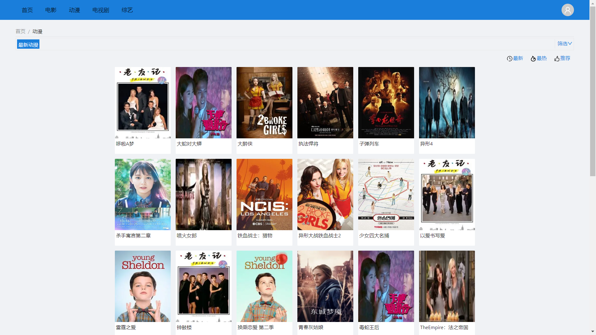
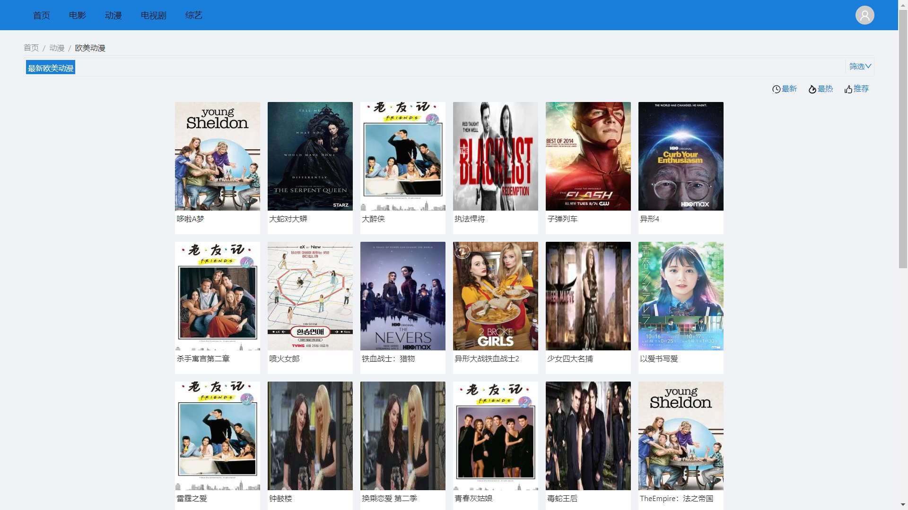
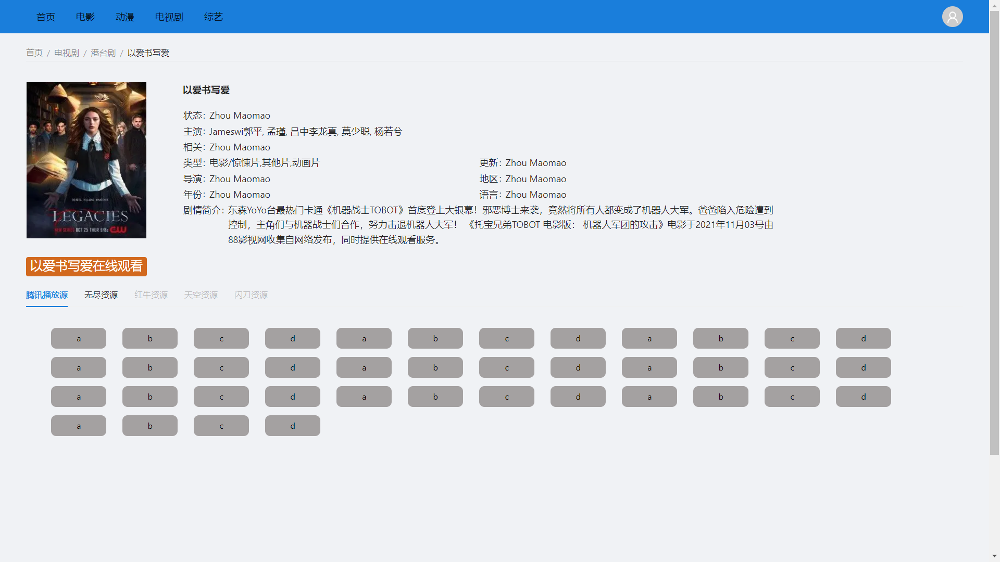

:v:: 如果觉得对您有帮助，希望点个:star:

# 相关

前端框架: `react18`

路由：`redux-router-dom`

状态管理：`react-redux`, `redux-toolkit`

组件库: `antd`

语言:  `TypeScript`

开源项目参考: [`BuildAdmin`]([BuildAdmin (gitee.io)](https://wonderful-code.gitee.io/))

构建工具: [`vite`]([Home | Vite中文网 (vitejs.cn)](https://vitejs.cn/))

# FantasyVideo

## 首页

## 类别导航

## 类别首页

### 一级类别

### 二级类别

## 筛选菜单

## 所有页面配置数据加载提示

## 影片详情页

### 剧情长度过长，只现实部分文字，自适应高度

## 宽度自适应

